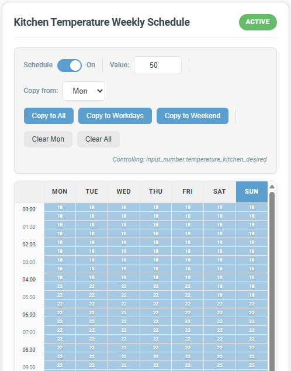
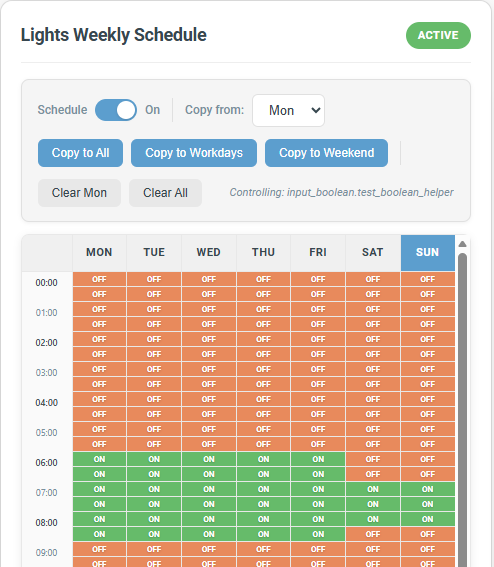

# Weekly Scheduler Card for Home Assistant

A Lovelace card for Home Assistant that provides an Outlook-style weekly calendar interface for the Weekly Scheduler integration.

## Screenshots

<p align="center">
  
  
</p>

## Features

- **Visual Weekly Calendar**: Drag-to-select time blocks across a 7-day grid with 30-minute intervals
- **Intuitive Interactions**: Click and drag to add or remove schedule blocks
- **Helper Entity Dropdown**: Select any `input_number` or `input_boolean` helper directly in the card editor
- **Automatic Schedule Creation**: Creates schedules automatically when selecting a new helper
- **Copy Functions**: Copy schedules to all days, workdays only, or weekends
- **Value Input**: Set specific values for `input_number` schedules
- **Enable/Disable Toggle**: Turn schedules on/off without losing configuration
- **Granular Permissions**: Control which actions are available per card instance (ideal for admin vs. regular user dashboards)
- **Mobile Edit Mode**: Prevents accidental schedule changes on mobile with an explicit edit toggle and 30-second auto-lock
- **Theme Support**: Respects Home Assistant's theme colors
- **Responsive Design**: Works on desktop and mobile devices

## Prerequisites

This card requires the **Weekly Scheduler** integration to be installed:
**[Weekly Scheduler Integration](https://github.com/hb9hkn/weekly_scheduler)**

## Installation

### HACS (Recommended)

1. Add this repository to HACS as a custom repository (category: Lovelace/Plugin)
2. Install "Weekly Scheduler Card" from HACS
3. Add the resource to your Lovelace configuration (HACS does this automatically)

### Manual Installation

1. Download `weekly-scheduler-card.js` from the [latest release](https://github.com/hb9hkn/weekly_scheduler_card/releases/latest)
2. Copy it to your `config/www/` directory
3. Add the card resource in your Lovelace configuration:

```yaml
resources:
  - url: /local/weekly-scheduler-card.js
    type: module
```

## Usage

### Using the Card Editor (Recommended)

1. Edit your dashboard
2. Click **Add Card**
3. Search for "Weekly Scheduler Card"
4. Select a helper entity from the dropdown
5. Optionally set a custom title

### Manual YAML Configuration

```yaml
type: custom:weekly-scheduler-card
helper_entity: input_number.bedroom_temperature
title: Bedroom Temperature Schedule
```

### Configuration Options

| Option | Type | Required | Default | Description |
|--------|------|----------|---------|-------------|
| `helper_entity` | string | Yes* | - | The helper entity to schedule (`input_number.*` or `input_boolean.*`) |
| `entity` | string | Yes* | - | Legacy: Direct schedule switch entity ID |
| `title` | string | No | Entity name | Card title displayed in the header |
| `schedule_toggle` | boolean | No | `true` | Show the enable/disable schedule toggle |
| `edit_schedule` | boolean | No | `true` | Allow grid interactions and value input |
| `copy_schedule` | boolean | No | `true` | Show copy-to-all, copy-to-workdays, copy-to-weekend buttons |
| `clear_schedule` | boolean | No | `true` | Show clear-day and clear-all buttons |

*Either `helper_entity` (recommended) or `entity` (legacy) is required.

### Example Configurations

**For an input_number helper:**
```yaml
type: custom:weekly-scheduler-card
helper_entity: input_number.thermostat_setpoint
title: Thermostat Schedule
```

**For an input_boolean helper:**
```yaml
type: custom:weekly-scheduler-card
helper_entity: input_boolean.guest_mode
title: Guest Mode Schedule
```

**Read-only view (e.g. for a regular user dashboard):**
```yaml
type: custom:weekly-scheduler-card
helper_entity: input_number.thermostat_setpoint
title: Thermostat Schedule
schedule_toggle: false
edit_schedule: false
copy_schedule: false
clear_schedule: false
```

**Allow toggling and editing, but no copy/clear:**
```yaml
type: custom:weekly-scheduler-card
helper_entity: input_number.thermostat_setpoint
title: Thermostat Schedule
copy_schedule: false
clear_schedule: false
```

**Legacy configuration (existing schedule entity):**
```yaml
type: custom:weekly-scheduler-card
entity: switch.weekly_schedule_thermostat_setpoint
title: Thermostat Schedule
```

## Interactions

### Adding Time Blocks

1. For `input_number` schedules, set the desired value using the slider in the toolbar
2. Click and drag on empty cells to create a block
3. Release to confirm the selection

### Removing Time Blocks

- Click and drag on existing (colored) blocks to remove them

### Copy Schedule

Use the toolbar buttons to copy schedules:
- **Copy to All**: Copy selected day's schedule to all 7 days
- **Copy to Workdays**: Copy to Monday through Friday
- **Copy to Weekend**: Copy to Saturday and Sunday

### Clear Schedule

- **Clear Day**: Clear schedule for a specific day
- **Clear All**: Clear the entire week's schedule

### Enable/Disable Schedule

- Use the toggle switch in the header to enable or disable the schedule
- When disabled, the schedule configuration is preserved but not applied

## Permissions

Permissions let you control which actions are available on each card instance. This is useful for creating separate dashboards for admin and regular users without needing Home Assistant user role detection.

The four permission groups are:

| Permission | Controls |
|------------|----------|
| `schedule_toggle` | The on/off switch for the schedule |
| `edit_schedule` | Grid drag interactions and the value input field |
| `copy_schedule` | Copy-to-all, copy-to-workdays, copy-to-weekend buttons and day selector |
| `clear_schedule` | Clear-day and clear-all buttons |

**Behavior:**
- All permissions default to `true` — existing cards are unaffected
- When a permission is disabled, those controls are hidden (not greyed out)
- When all permissions are disabled, the toolbar is hidden entirely and the grid is non-interactive, creating a clean read-only view
- Permissions can be configured via the card editor UI (checkboxes) or in YAML

### Setting up admin vs. regular user dashboards

1. Create a dashboard/view for admin users with a full-access card (default config)
2. Create a separate dashboard/view for regular users with a restricted card (permissions set to `false`)
3. Assign dashboard visibility per user in Home Assistant

## Mobile Edit Mode

On mobile screens (card width < 600px), an **Edit Mode** toggle appears above the toolbar. This prevents accidental schedule changes from touch interactions.

- **Edit Mode OFF** (default): The schedule grid is non-interactive and the toolbar is hidden. The card displays the schedule as a read-only visualization.
- **Edit Mode ON**: The permitted controls appear and the grid becomes interactive (if `edit_schedule` is enabled).
- **Auto-lock**: After 30 seconds of no interaction, edit mode silently turns off automatically.
- The auto-lock timer resets on any touch, click, or input within the card.
- On desktop screens (>= 600px), there is no edit mode toggle — permitted controls are always visible.

## Creating a New Schedule

If you select a helper entity that doesn't have a schedule yet:

1. The card will show a "Create Schedule" button
2. Click the button to create a new schedule for that helper
3. A new switch entity will be created (e.g., `switch.weekly_schedule_bedroom_temperature`)
4. You can then start adding time blocks

## Troubleshooting

### Card not loading after update

If the card doesn't work properly after updating to a new version, try:
1. Clear your browser cache
2. Hard refresh the page (Ctrl+Shift+R or Cmd+Shift+R)

The card includes automatic version mismatch detection and will reload the page once if needed.

### Helper entities not showing in dropdown

Ensure you have `input_number` or `input_boolean` helpers created in Home Assistant:
- Go to **Settings** > **Devices & Services** > **Helpers**
- Create a new Number or Toggle helper

## License

MIT License
